> [!NOTE]
> **Как я использовал ИИ при разработке**
>
> 1. Я просил ИИ сгенерировать диаграммы компонентов, а домены и границы контекстов описывал самостоятельно.
> 2. ИИ предлагал избыточные архитектурные решения. Я решил упростить проект до достаточной реализации.
> 3. Я просил ИИ находить противоречия в диаграммах, а исправлял их самостоятельно.
> 4. Я просил ИИ оценить соответствие документа требованиям и на основе этой оценки принимал решения об исправлениях.
> 5. ИИ помогал описывать работу системы и план перехода к новой архитектуре.
> 6. ИИ помогал формулировать и редактировать текст документа.

# Warmhouse

Это шаблон для решения проектной работы. Структура этого файла повторяет структуру заданий. Заполняйте его по мере работы над решением.

# Задание 1. Анализ и планирование

<aside>

Чтобы составить документ с описанием текущей архитектуры приложения, можно часть информации взять из описания компании и условия задания. Это нормально.

</aside>

### 1. Описание функциональности монолитного приложения

**Управление отоплением:**

- Пользователи могут удалённо управлять отоплением в доме;
- Система поддерживает управление отоплением через взаимодействия, инициируемые сервером;
- Система поддерживает подключение отопительного оборудования только с участием специалиста, выезжающего на место; самостоятельное подключение датчиков пользователем не предусмотрено;
- Система позволяет создавать, изменять и удалять записи датчиков, указывать их название, тип, локацию и единицу измерения;
- Пользователи могут просматривать список датчиков и сведения об отдельном датчике по его идентификатору.

**Мониторинг температуры:**

- Пользователи могут получать температуру по локации или идентификатору датчика, а также просматривать показания в списке датчиков;
- Система поддерживает синхронное получение температуры;
- Пользователи могут просматривать показания вместе с единицей измерения, статусом и временем последнего обновления данных;
- Система позволяет явно обновлять и сохранять показание и статус датчика с фиксацией времени обновления;
- Система хранит текущее показание без истории измерений;
- Система возвращает сохранённые данные при недоступности внешнего API для запроса списка или отдельного датчика; запрос температуры по локации в этом случае завершается ошибкой.

В предоставленном монолите успешный опрос обновляет значение, статус и время только
в ответе GET. В БД они попадают через явные PUT/PATCH; при ошибке GET возвращает
последний такой снимок, без признака устаревания.

### 2. Анализ архитектуры монолитного приложения

- Язык программирования: Go
- База данных: PostgreSQL
- Архитектура: Монолитная, все компоненты системы (обработка запросов, бизнес-логика, работа с данными) находятся в рамках одного приложения.
- Взаимодействие: Синхронное, запросы обрабатываются последовательно.
- Масштабируемость: Ограничена, так как монолит сложно масштабировать по частям.
- Развертывание: Требует остановки всего приложения. Используются файлы `Dockerfile` и `docker-compose.yml`
- Организация кода: `handlers` — обработка запросов и координация операций; `models` — структуры данных; `db` — SQL-запросы через pgxpool; services — интеграция с API температуры. Обработчики напрямую вызывают и БД, и внешний API
- Авторизация и аутентификация отсутствует


### 3. Определение доменов и границы контекстов

**As-Is: удалённое управление отоплением дома.**

- Управление устройствами: учёт датчиков, их идентификаторов, типов и расположения; подключение оборудования выполняет специалист.
- Управление отоплением: пользователь задаёт желаемое состояние отопления. Возможность заявлена в описании компании; предоставленный код сохраняет значение датчика, но не показывает передачу управляющей команды.
- Мониторинг температуры: получение измеренной температуры и статуса датчиков. Измеренное значение отличается от желаемого состояния.

Это бизнес-поддомены текущей системы. В коде они ещё не отделены друг от друга:
используются общие обработчики и модель `Sensor`.

### **4. Проблемы монолитного решения**

- При добавлении нового функционала потребуется вносить изменения в общую кодовую базу, из-за чего повышается вероятность поломки текущей функциональности.
- При обновлении приложения, может потребоваться полное прекращение работы всего приложения, что может повлиять на пользовательский опыт. Например, при внесении новой функциональности в "Управление устройствами" может быть временна прекращена обработка запросов в "Управлении параметрами устройств"
- Потенциально трудное масштабирование компонентов системы: например, "Управление устройствами" требует меньшей нагрузки, чем "Управлении параметрами устройств", но так как приложение монолитное, мы не сможем раздельно их масштабировать.
- С ростом кодовой базы есть риск роста времени разработки и развертывания.

### 5. Визуализация контекста системы — диаграмма С4

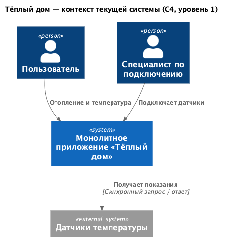

### 6. План перехода к целевой архитектуре

Переход выполняется поэтапно, с временной совместной работой монолита и новых сервисов.

1. **Подготовить данные и критерии приёмки.** Проверить 100 существующих подключений,
   определить владельцев, модели и адреса устройств; сделать резервную копию PostgreSQL.
   Зафиксировать сценарии проверки сохранённых показаний, статуса и времени, удаления
   датчиков и поведения связанных сценариев. Проверить их до полного переключения пользователей.
2. **Реализовать и развернуть сервисы рядом с монолитом.** Подключить внешнюю авторизацию,
   реализовать API и адаптеры существующего оборудования. QA проверяет создание устройств,
   чтение и запись температуры, возврат сохранённого снимка при сбое, команды,
   сценарии разных комнат, отказ устройств и доступ только
   к данным владельца. Текущие пользователи продолжают работать через монолит.
3. **Перенести каталог и показания пилотной группы.** Создать модели и устройства с `owner_id`,
   сохранить соответствие старых `sensor.id` новым UUID. Обозначения температурных единиц
   привести к `Cel` (°C), `[degF]` (°F) или `K`; неизвестные обозначения уточнить до переноса.
   Перенести `value`, `status`, `last_updated` в БД мониторинга по новым ID;
   температуру преобразовать из прежней единицы в `Cel`.
   Сохранить прежнее `last_updated`, не подставлять дату миграции; неизвестное `source_time`
   не заполнять. Исходное `0/inactive` без подтверждённой записи не считать измерением.
   До переключения монолит остаётся источником изменений; на финальную сверку
   приостановить запись метаданных и показаний группы. Затем переключить запись каталога
   на сервис устройств, а запись показаний — на мониторинг. Для каждой группы остаётся
   один путь записи; исходную БД и таблицу соответствия сохранить для отката.
4. **Провести пилот.** Сначала переключить чтение показаний и сравнить результаты,
   затем включить управление и сценарии. Команду физическому устройству отправляет
   только один выбранный путь. Проверить потерю связи, таймауты и перенос устройства
   между комнатами; функции, ещё не покрытые новой системой, оставить в монолите.
5. **Расширить переход и завершить миграцию.** После успешной приёмки переводить
   пользователей небольшими группами, обучить поддержку и обновить инструкции.
   Отключить монолит после переноса всех необходимых функций и данных и проверки
   работы всех групп; резервную копию сохранить на согласованный срок.
6. **Предусмотреть откат.** При ошибках остановить новые управляющие вызовы, сверить
   изменения данных после переключения, перенести последние показания обратно с преобразованием
   единиц и сохранением времени, затем вернуть запросы на проверенный прежний путь.
   Для отопления отдельно проверить старый контур управления: предоставленный код монолита
   команды оборудованию не отправляет. Выполненные команды автоматически не повторять и не отменять.
   Новые возможности света, ворот и камер, которых нет в монолите, при сбое временно отключать отдельно.

# Задание 2. Проектирование микросервисной архитектуры

### Модульные комплекты и подключение

В целевой системе пользователь выбирает отдельные комплекты партнёров под нужные функции дома.
«Тёплый дом» обеспечивает совместимость с платформой и поддержку, а оборудование
производят партнёры. Комплекты можно подключать независимо и дополнять позднее.

| Комплект | Основное оборудование | Возможности |
| --- | --- | --- |
| Отопление | Термостат со встроенным датчиком температуры; дополнительный датчик для мониторинга других помещений | Просмотр температуры и установка целевой температуры термостата |
| Освещение | Реле управления совместимым светильником | Включение, выключение и просмотр состояния света |
| Ворота | Контроллер замка совместимых автоматических ворот | Запирание, отпирание и просмотр состояния замка |
| Наблюдение | IP-камера | Просмотр видео и проверка доступности камеры |


Для включения модели в MVP её адаптер должен быть реализован и проверен.
Партнёр обеспечивает доступный сервисам платформы HTTPS API устройства и способ
разрешить доступ к нему; для камеры также предоставляет совместимый с адаптером видеопоток.
Подключения только к локальной домашней сети недостаточно: адрес интеграции должен
быть доступен платформе через интернет. Данные и правила авторизации оборудования
определяются при реализации интеграции с партнёром; `POST /devices` не передаёт
отдельные учётные данные партнёра. Отдельный датчик даёт дополнительные показания;
автоматическое управление термостатом по его показаниям в текущем MVP не предусмотрено.

1. **Установить оборудование.** Пользователь размещает комплект и подключает его
   к оборудованию дома и питанию по инструкции производителя. Настройка в SaaS
   выполняется самостоятельно, без выезда специалиста «Тёплого дома».
2. **Подготовить связь.** Подключить устройство к домашней сети, выполнить настройку
   удалённого доступа средствами партнёра и получить адрес API; для камеры — также
   адрес видеопотока. На этом этапе партнёр проверяет право доступа к физическому прибору.
3. **Добавить устройство в личном кабинете.** Войти в аккаунт, выбрать модель из
   каталога, указать имя, комнату, адрес API и настройки модели. Для камеры указать
   адрес видеопотока. Если в комплекте несколько самостоятельных устройств, добавить
   каждое отдельно. Платформа регистрирует их за текущим пользователем.
4. **Проверить работу.** Открыть показания или видео; для управляемого устройства
   отправить пробную команду и проверить фактическое состояние. Если устройство
   недоступно, проверить питание, сеть и настройки доступа у партнёра. Успешная
   регистрация в каталоге сама по себе не подтверждает доступность оборудования.
5. **Настроить сценарии.** Объединить команды своих устройств, в том числе из разных
   комнат, и проверить ручной запуск сценария. Позднее можно добавить новые комплекты.


### Диаграммы C4

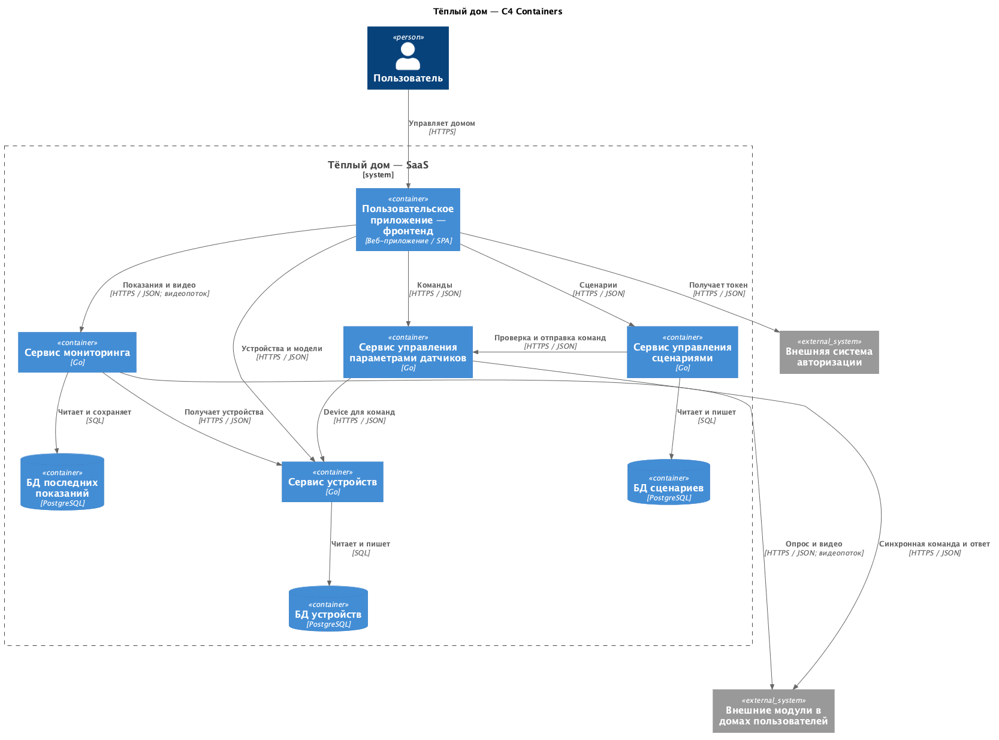

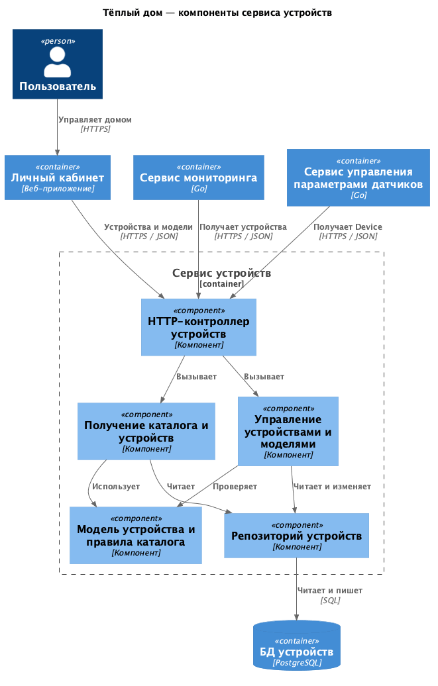

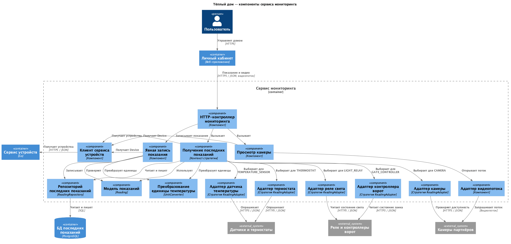

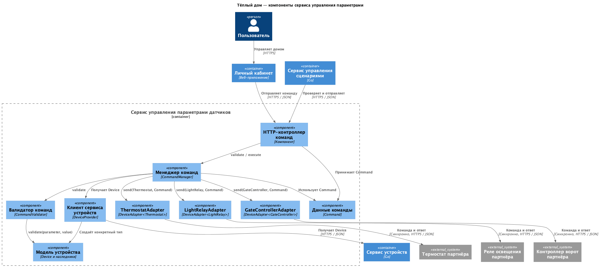

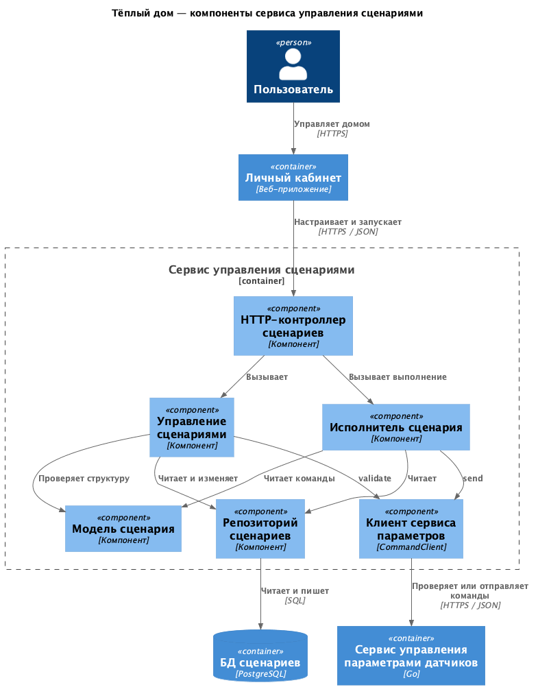

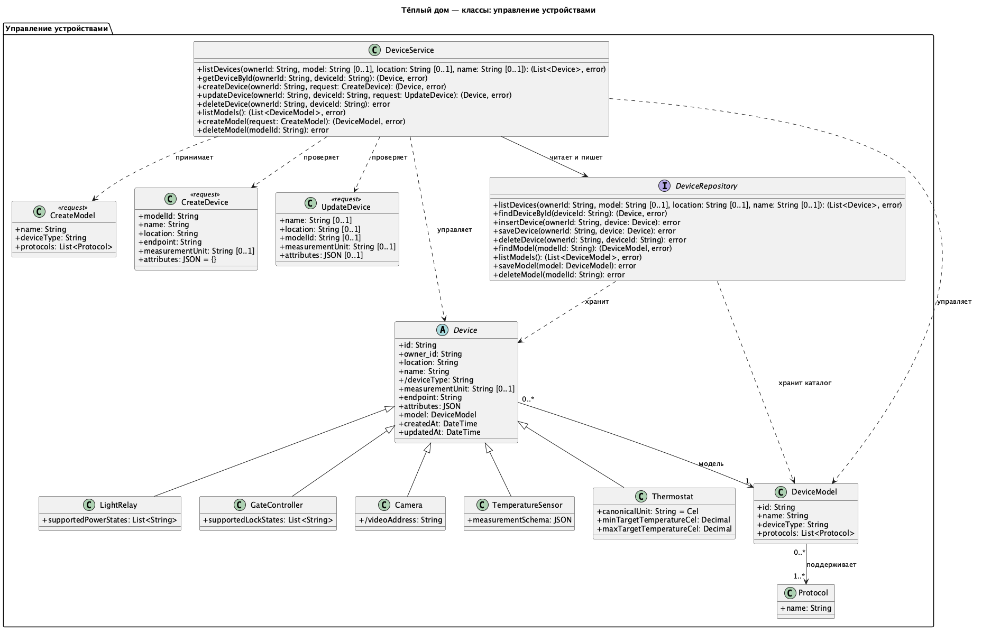

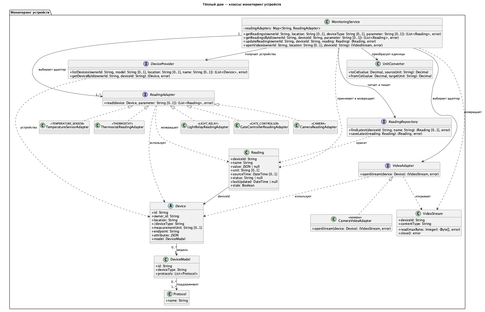

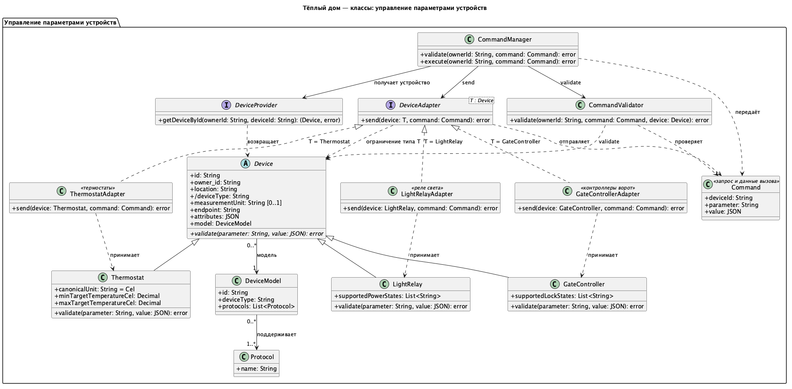

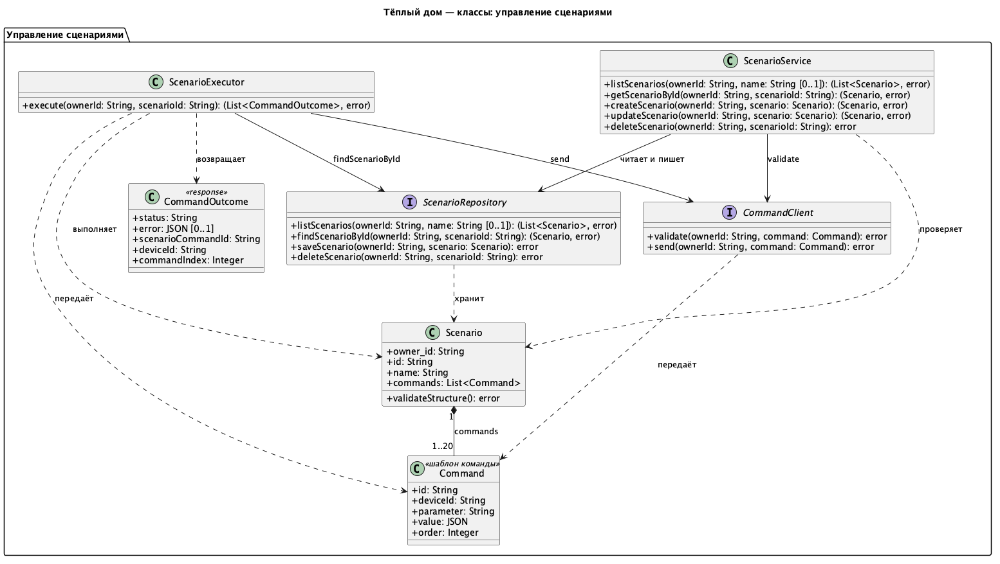

# Задание 3. Разработка ER-диаграммы

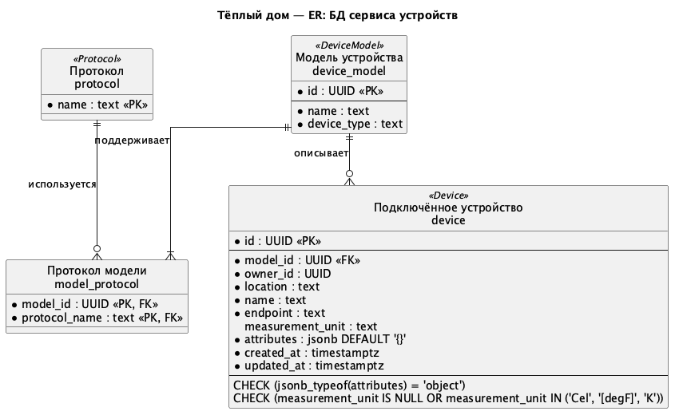

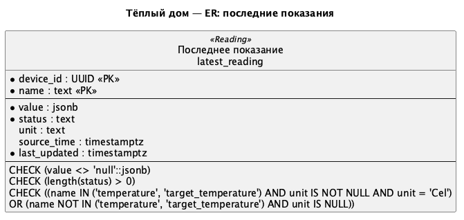

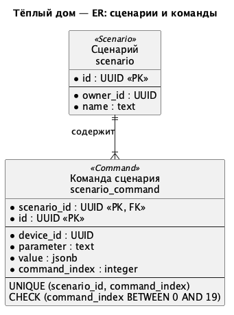

# Задание 4. Создание и документирование API

### 1. Тип API

Для целевой системы выбран **REST API по HTTPS с JSON**. Он подходит для каталога,
подключения устройств, чтения показаний, настройки сценариев и проверки результатов
команд. Каждый сервис предоставляет собственный API и обращается к другим сервисам
через их контракты; прямого чтения чужих таблиц нет.

Для нас особенно важны **простота интеграции с UI и возможность добавлять новые
модули устройств, структура данных которых заранее неизвестна**:

- REST API по HTTPS с JSON удобно вызывать из веб-интерфейса стандартными
  средствами браузера, например `fetch`. Для списков, карточек устройств и форм
  настройки используются обычные HTTP-запросы без дополнительного протокола
  или обязательной генерации клиента.
- Общие поля устройства сохраняют стабильный контракт, а особенности новых
  модулей можно описывать в расширяемых JSON-полях `attributes`, `measurement_schema`
  и `value` команды. Это позволяет адаптировать обмен данными к новым типам
  устройств без изменения общей структуры каждого запроса и ответа.
  Гибкость обеспечивается выбранной моделью данных и JSON; REST задаёт способ
  обращения к ресурсам. Для нового модуля всё равно определяются правила
  проверки данных, адаптер устройства и, при необходимости, элементы UI.

**JSON выбран как формат запросов и ответов** по следующим причинам:

- Устройства, модели и сценарии состоят из строк, чисел, объектов и списков,
  которые естественно представляются в JSON.
- Поля `attributes`, `measurement_schema` и `value` команды могут содержать
  вложенные структуры и значения разных типов. Например, целевая температура
  передаётся числом, а признак включения — логическим значением. Допустимые типы
  и структуру данных сервис проверяет по контракту конкретного параметра.
- Текстовые запросы и ответы удобно читать и проверять в Postman, браузере
  или через curl без специального декодирования.
- JSON поддерживается большинством языков и веб-фреймворков; для обмена данными
  не требуется генерация кода.

Для наших структур JSON обычно менее многословен, чем XML. По сравнению с Protobuf
он удобнее для ручной отладки, но обычно уступает в компактности и сам по себе
не обеспечивает строгую типизацию. В текущем учебном проекте нет требований
к минимальному размеру сообщений или высокой частоте обмена, поэтому приоритет
отдан простоте разработки и проверки API. REST не предписывает формат данных:
JSON выбран отдельно с учётом этих требований.

Сервисы и устройства взаимодействуют синхронно по HTTP. Для описания API выбран
[OpenAPI 3.1](https://spec.openapis.org/oas/v3.1.0.html).

### 2. Документация API

Спецификации описывают **проектируемую систему**. Код текущего монолита эти
контракты пока не реализует. Адреса в домене `.example` служат примерами.

| Сервис | Спецификация | Основные операции |
| --- | --- | --- |
| Устройства | [OpenAPI](api/devices.openapi.yaml) | Создание устройства текущим пользователем; список с фильтрами model, location, name; получение по ID; изменение имени, локации, модели/типа, единицы измерения и атрибутов; удаление устройства; каталог моделей |
| Мониторинг | [OpenAPI](api/monitoring.openapi.yaml) | Чтение `/observations` с фильтрами; запись значения и статуса через `PATCH /observations/{device_id}`; сохранённые показания при ошибке опроса; `/video` по device_id |
| Управление параметрами датчиков | [OpenAPI](api/parameters.openapi.yaml) | Проверка команды и синхронный вызов устройства по device_id с проверкой владельца |
| Управление сценариями | [OpenAPI](api/scenarios.openapi.yaml) | Список с фильтром name; получение и удаление по ID; создание, изменение и выполнение команд устройств из разных комнат без хранения запусков |

В мониторинге используется единая модель `Reading` для адаптеров, сервиса и репозитория.
HTTP-контроллер преобразует данные запроса `update_reading` в `Reading`, добавляя ID устройства
из пути. При сохранении сервер назначает `lastUpdated`; в `latest_reading` сохраняются значение,
статус, единица и времена показания. Температура хранится в `Cel`, а единица ответа определяется
настройкой устройства. Поле `stale` формируется для ответа и не хранится в БД.
Значение и статус обязательны при записи; `null` используется в ответе при отсутствии показания.

`DELETE /devices/{device_id}` удаляет регистрацию своего устройства, сохраняя модель
в каталоге. Удалённое или отсутствующее устройство даёт `204`; чужое устройство — `403`.
Проверка владельца и удаление атомарны. Повторная регистрация получает новый ID.
При одновременном изменении устройства для переданных полей действует последнее сохранение.

Показания обновляются по последнему завершённому сохранению: запоздалый опрос может
перезаписать ручную запись. Смена модели или атрибутов устройства не удаляет прежние показания.

Новые запросы показаний, записи, видео и команд по удалённому ID получают `404`;
списки устройств и показаний его исключают. Снимки остаются в БД мониторинга недоступными:
физическая очистка этой БД не входит в удаление регистрации. Сценарии и их команды
сохраняются для редактирования; при запуске команда удалённому устройству получает
`FAILED`, последующие — `NOT_SENT`. Для сохранения сценария такую команду нужно убрать
или заменить. Запросы и потоки, прошедшие проверку до удаления, могут завершиться;
физическое оборудование и доступ у партнёра не отключаются.

# Задание 5. Работа с docker и docker-compose

Реализован минимальный [temperature-api](apps/temperature-api/main.go): один Go-файл,
стандартная библиотека, без внешних зависимостей и БД. При каждом запросе генерируется
случайная температура от 15 до 30 °C с текущим временем и статусом `active`.
Поддерживаются `GET /temperature` с query-параметрами `location` и `sensor_id`
и `GET /temperature/{sensor_id}`, например `/temperature?location=Living%20Room`
или `/temperature/1`.

[Docker Compose](apps/docker-compose.yml) запускает PostgreSQL 16, temperature-api
на порту 8081 и исходный монолит на порту 8080. База `smarthome` и таблица `sensors`
создаются скриптом `apps/smart_home/init.sql` при первом запуске с пустым томом.
Монолит запускается после готовности PostgreSQL и temperature-api.

Запуск из корня проекта:

```sh
cd apps
docker-compose up --build -d --wait
```

Для проверки случайных показаний повторите запрос
`http://localhost:8081/temperature?location=Living%20Room`.
Код монолита не изменён: `Get All Sensors` обращается к `/temperature/{id}`
и получает новые показания. Для проверки создайте датчик и повторите запрос
`http://localhost:8080/api/v1/sensors`.

Подробные команды проверки и остановки — в [apps/README.md](apps/README.md).
